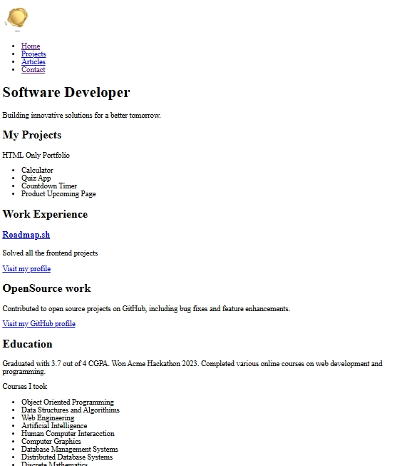

# Roadmap.sh-projects

This repository contains front-end projects built following the [roadmap.sh](https://roadmap.sh/) front-end developer path.

## Projects List

[[[Basic HTML Website](https://roadmap.sh/projects/basic-html-website), ](https://roadmap.sh/projects/single-page-cv)

https://roadmap.sh/projects/basic-html-website

Click any of the images below to view the readme and live demo of the project.

<table align="center">
<tr>

<td align="center" width="300px">

 <b>Single-page-cv</b>
</td>

<td align="center" width= "300px">

 <b>Basic-html-website</b>
</td>

</tr>
</table>
    
  </figure>
